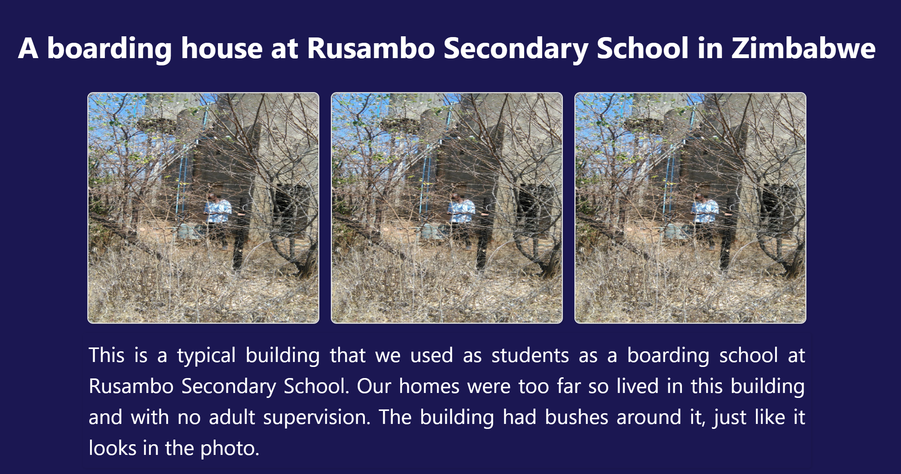

# Image Rendering App
## Description
This project is a simple React application that displays images of a typical boarding school building along with a descriptive paragraph. The images and text are styled to provide a visually appealing layout.

## Table of Contents

- [Image Rendering App](#image-rendering-app)
  - [Description](#description)
  - [Table of Contents](#table-of-contents)
  - [Overview](#overview)
  - [Features](#features)
  - [Clone the repository:](#clone-the-repository)
  - [Installation](#installation)
  - [Usage](#usage)
  - [Project Structure](#project-structure)
  - [Contributing](#contributing)
  - [Fork the repository.](#fork-the-repository)
- [Credits](#credits)

## Overview
The Image Rendering App is designed to showcase images of a boarding school building at Rusambo Secondary School, accompanied by a descriptive paragraph. The app demonstrates the use of React components and CSS for styling.

## Features
Display multiple instances of an image.
Centered paragraph with justified text.
Responsive and visually appealing design.
Installation
To run this project locally, follow these steps:

## Clone the repository:

bash
Copy code
git clone https://github.com/yourusername/image-rendering-app.git
cd image-rendering-app

## Installation
Install the dependencies:

bash
Copy code
npm install
Start the development server:

bash
Copy code
npm start

## Usage
After starting the development server, open your browser and navigate to http://localhost:3000 to see the application in action.

Here is a screenshot of the app:

## Project Structure
plaintext
Copy code
image-rendering-app/
├── public/
│   ├── index.html
│   └── ...
├── src/
│   ├── assets/
│   │   └── boarding.jpg
│   ├── App.css
│   ├── App.js
│   ├── index.js
│   └── ...
├── .gitignore
├── package.json
└── README.md
public/: Contains the HTML template and static assets.
src/: Contains the source code for the application.
assets/: Contains the image file used in the app.
App.css: Contains the CSS styles for the app.
App.js: Contains the main React components.
index.js: Entry point for the React application.
.gitignore: Specifies files to ignore in the repository.
package.json: Lists the project dependencies and scripts.
README.md: Provides information about the project.
Technologies Used
React: A JavaScript library for building user interfaces.
CSS: Styling the components.
HTML: Structuring the content.
JavaScript: Programming logic for the application.

## Contributing
Contributions are welcome! If you have any ideas, suggestions, or bug reports, please create an issue or submit a pull request.

## Fork the repository.
Create a new branch: git checkout -b my-feature-branch.
Make your changes and commit them: git commit -m 'Add some feature'.
Push to the branch: git push origin my-feature-branch.
Open a pull request.
License
This project is licensed under the MIT License. See the LICENSE file for details.
# Credits 
https://react.dev/learn/describing-the-ui

Currently, two official plugins are available:

- [@vitejs/plugin-react](https://github.com/vitejs/vite-plugin-react/blob/main/packages/plugin-react/README.md) uses [Babel](https://babeljs.io/) for Fast Refresh
- [@vitejs/plugin-react-swc](https://github.com/vitejs/vite-plugin-react-swc) uses [SWC](https://swc.rs/) for Fast Refresh
